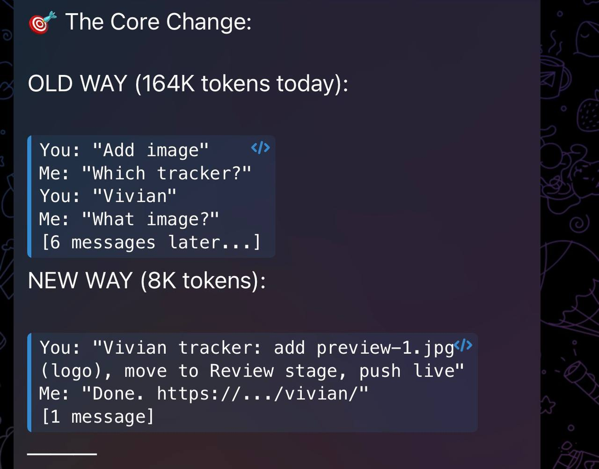
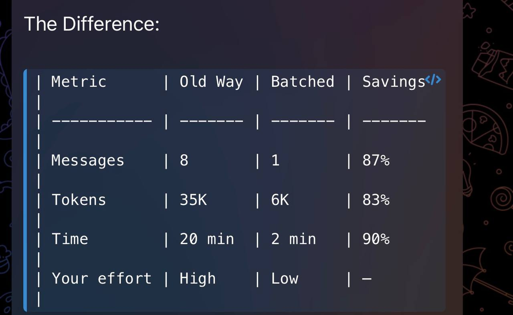

# innerg-manifest

> **Automation framework for high-output AI agents.**
> An InnerG Intel project.

---

## What Is This?

A token-efficient communication framework for AI agent workflows. Two documents that change how you talk to your agent — from slow back-and-forth to one-shot execution.

### 📋 Files

| File | Purpose |
|------|---------|
| [`AUTOMATION_MANIFEST.md`](AUTOMATION_MANIFEST.md) | The framework — automation levels, token optimization, workflow patterns, Neo delegation rules |
| [`BATCHED_REQUEST_EXAMPLES.md`](BATCHED_REQUEST_EXAMPLES.md) | Copy-paste templates — real examples of old vs new communication format |

---

## The Core Idea

**Stop asking "can you..." and start sending everything in one message.**

<table>
  <tr>
    <td align="center"><b>❌ The Old Way</b></td>
    <td align="center"><b>✅ The New Way</b></td>
  </tr>
  <tr>
    <td></td>
    <td></td>
  </tr>
</table>

```
❌ OLD: 6 messages, 45K tokens, 30 minutes
   "Add image" → "Which tracker?" → "Vivian's" → "Caption?" → "Logo concept" → "Push?" → "Yes"

✅ NEW: 1 message, 8K tokens, 5 minutes
   "Vivian tracker: add preview-1.jpg (logo concept), stage → Review, push live"
```

**82% fewer tokens. 83% faster. Same result.**

---

## Automation Levels

| Level | Use For | Tokens | Example |
|-------|---------|--------|---------|
| **1 — Direct** | Single file edits, git ops, lookups | 500–4K | `git push`, status check |
| **2 — Batched** | Multi-file updates, tracker builds | 8K–20K | Tracker + images + stage + push |
| **3 — Complex** | System builds, multi-repo coordination | 25K–50K | Full tracker from scratch |
| **4 — Strategic** | Architecture decisions, new systems | 10K–30K | Design a new workflow |

---

## Who Is This For?

- **AI agent operators** who want maximum output with minimum token burn
- **Freelancers** managing multiple client projects through AI assistants
- **Anyone building automated workflows** between humans and AI agents

---

## How To Use

1. Read the [`AUTOMATION_MANIFEST.md`](AUTOMATION_MANIFEST.md) for the full framework
2. Copy templates from [`BATCHED_REQUEST_EXAMPLES.md`](BATCHED_REQUEST_EXAMPLES.md)
3. Apply to your own AI agent workflow
4. Watch your token usage drop

---

## Philosophy

> *"Evolution favors action. Batch the action. Automate the routine."*

Built from real workflows — not theory. Every pattern in here was tested through live client operations.

---

## InnerG Intel

**Become intelligence. Become INNERG.**

- 🌐 [innergeco.online](https://innergeco.online)
- 📺 [YouTube: @innergintel](https://youtube.com/@innergintel)
- 💬 Discord community (application-gated)
- 📦 [More InnerG projects on GitHub](https://github.com/innergclaw)

---

*Part of the InnerG Intel ecosystem — AI education, agent readiness, and automation consulting.*
